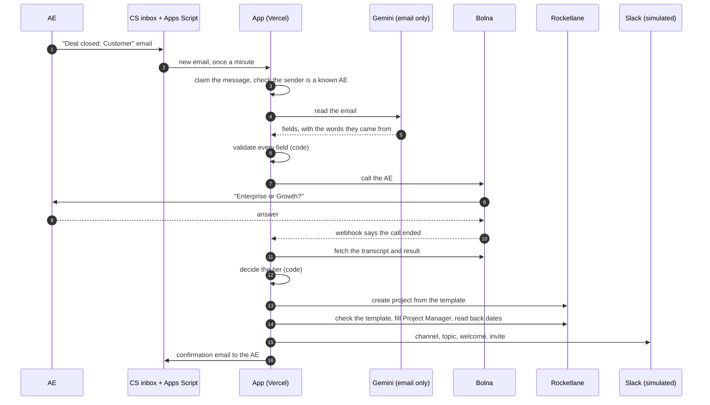
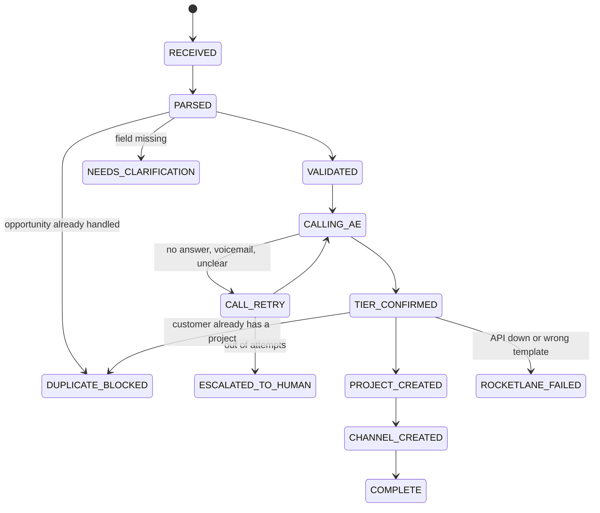

# How it works

The short version: an LLM reads the email and a voice agent holds the phone call, and plain code makes every decision that matters. If the code can't be sure, it stops and asks a person.

## The flow

Anything that goes wrong along the way ends in the escalation queue on the dashboard, with the reason written down.

## What the AI does and what it doesn't

Two pieces are AI. Everything else is ordinary code.

| Piece | AI or code | Why |
| --- | --- | --- |
| Reading the deal email into fields | **LLM** (Gemini 2.5 Flash). It has no plan-tier field to fill in, and it has to quote the words each value came from. | Emails are free text and AEs write them differently |
| Holding the phone conversation | **Bolna's voice agent**, following a short fixed script | Needs to listen and talk |
| Checking the extracted fields | Code. A value only counts if it appears in the email text. The opportunity ID comes from the link itself, never from the model. | A model can invent a plausible value |
| Deciding the plan tier | Code. The AE's own words must contain one plan, with no hedge ("I think", "probably"), no second plan and no negation. Bolna's own summary is only a hint. | This is the decision the whole job turns on |
| Picking the template | Code. A fixed table from tier to template. | The manual process mixed templates up |
| Checking the project | Code. Rocketlane's reply must name the template we asked for, by ID and by name. | Catches a swapped or wrong ID |
| Retries, duplicates, escalation | Code | Should be predictable |

I kept the AI out of the decisions on purpose. If the model is wrong about an email, validation catches it. If the voice agent mishears, the transcript check catches it. Neither can start a project on its own.

## The workflow

The whole thing runs as one Vercel Workflow per deal. That's what lets a deal wait on a phone call for minutes, then pick up exactly where it left off, even if a server restarts in between.

- The workflow opens a wait for the call result before it dials, so a fast webhook can't be missed.
- Bolna's webhook only wakes it up. The result is always fetched from Bolna directly.
- If the webhook never arrives, a timer wakes the workflow and it checks Bolna itself.
- Each step can run twice without doing its work twice (see below).

The decision logic is in `lib/pipeline/orchestrator.ts` and does no I/O itself. That's why almost all of it can be tested without any service.

## Deal states

Only the moves in this picture are allowed. The code refuses any other, so nothing can jump from "validated" to "project created" without a confirmed tier. Every state that is still working can also move to `ESCALATED_TO_HUMAN`.

## Guardrails

| Guardrail | How it works |
| --- | --- |
| No guessing on missing data | Every field is checked against the email text. Anything missing or invented gets a note back to the AE, and no call, project or channel is created. |
| No project without a clear tier | See "deciding the plan tier" above. Three attempts by default, then a person. |
| Everything is logged | Each step writes a timestamp, its input, its output and the reason. The deal page shows it and the whole log exports as JSONL. |
| Email is untrusted | The system prompt treats the email as data. The model has no tier field. An email that says "plan: Enterprise" still gets a call, and the AE's spoken answer wins. Names are escaped before they reach Slack. |
| Only known AEs | The AE is identified by the sender address. Unknown senders are escalated before the email is read, with no reply and no call. Mail that fails SPF/DKIM/DMARC is escalated too. |
| No double work | A message is claimed once. A Salesforce opportunity is claimed once. Each call attempt and each webhook event is claimed. A project created by an attempt that timed out is adopted, not duplicated. |
| Wrong template can't pass | After creating a project the app reads back the template and compares ID and name. A mismatch is left alone and escalated, not retried. |
| Honest dates | The dashboard and Slack show the schedule Rocketlane reports, not our own arithmetic. |
| Webhook origin | A secret in the URL, Bolna's published IPs, and the result is fetched from Bolna anyway. |
| People stay in charge | The escalation queue holds anything the agents stopped on, and posts to an ops channel. |
| Calm retries | Rocketlane and Slack calls retry with growing delays and honour rate-limit headers. Bad credentials are not retried. |
| Privacy | Contact and AE emails are masked on the dashboard. No secrets are stored in the repo. |

## What's real and what's simulated

Gmail, the email model, the phone call and Rocketlane are all real. Slack is simulated, as the brief allows: the channel, topic, welcome message and invite are written to the store and shown on the dashboard. Each integration has a live client and a test double behind the same interface, picked by an environment variable. The test doubles can be told to fail, which is how most of the failure tests work.

## Decisions I'd defend

- **Apps Script instead of Gmail push.** Push needs a Google Cloud project, Pub/Sub, and a verified OAuth app. A script inside the inbox needs none of that and polls once a minute. For this volume the delay doesn't matter.
- **Gemini 2.5 Flash.** My AI Gateway free tier couldn't call Claude. I ran the same email and injection checks against several cheap models. Gemini 2.5 Flash passed 9 runs out of 10 at about a tenth of a cent per email, and the other models either followed the injected instructions or were flaky.
- **Templates live in Rocketlane.** The app doesn't build tasks. It creates a project from a Rocketlane project template, so the CS team can edit the process without touching code. Rocketlane confirmed this was the right approach.
- **The verification task.** Priya's complaint about migration tasks marked done without checking the data is handled in the template: a final "Customer data verified — evidence attached" task that depends on the other migration tasks. I didn't find a way in Rocketlane to force an attachment, so it's a visible checkpoint, not a lock.
- **Overdue escalation in Rocketlane.** The brief asks for it inside the tool, which is also where the CS team will look for it.

## What I'd change before real customers

- **Gmail push** through Pub/Sub, to get the email in seconds and drop the polling.
- **Real Slack**: create the channel with the Web API and invite the customer through Slack Connect, which needs a paid plan.
- **Webhook signing.** Bolna offers none today. I'd ask for it, or put a small signed proxy in front.
- **The AE directory** from the CRM or HR system, with AE time zones so nobody gets called at night.
- **SSO** on the dashboard instead of one shared password.
- **Logs** sent to a proper log store with alerts, instead of living only in Redis.
- **A real clarification loop**: merge the AE's reply into the original deal.
- **Cost and abuse limits** on calls per AE per day.
- **Rocketlane access** through a service account with only the scopes it needs.

## Known limits

- Clarification means resending the whole email.
- The phase windows (how the 30 and 14 days split across the four phases) are my assumption. The brief only gives the totals.
- Template durations are working days, so a 30-day plan lands about six weeks out in calendar time.
- Filling the Project Manager role is tried once. If it fails it's logged, and the project still goes ahead.
- There's one AE, read from environment variables.
